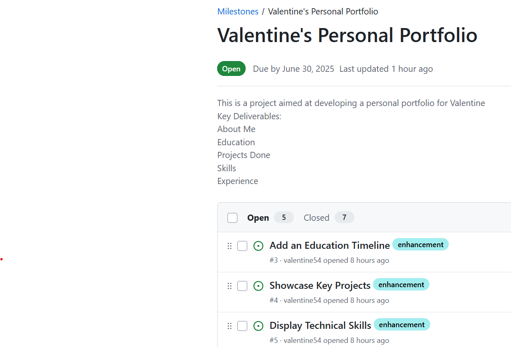
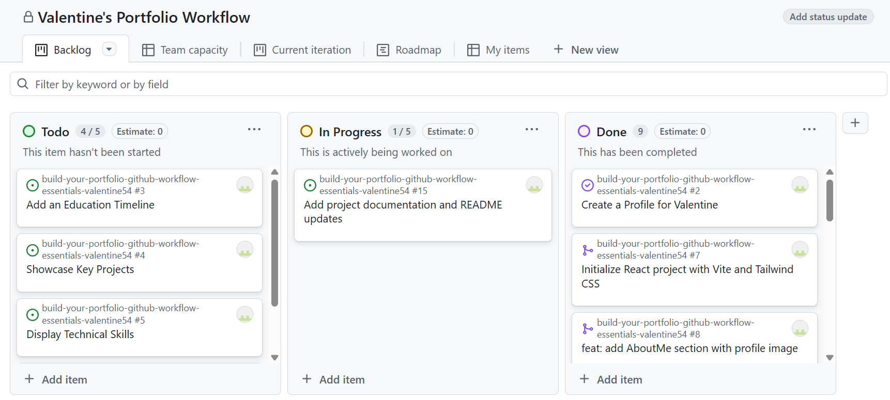
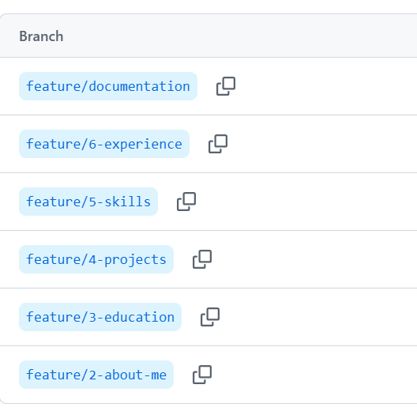
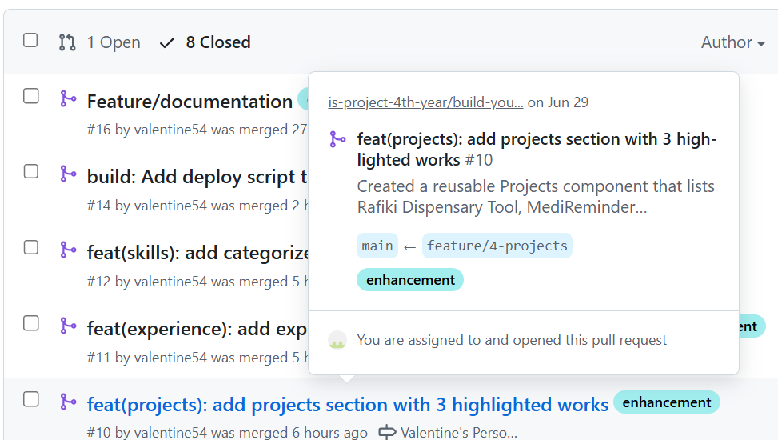
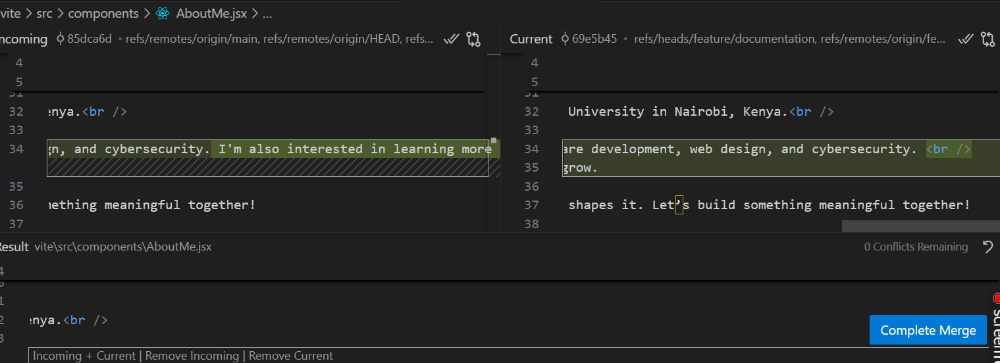

# Personal Portfolio Documentation

## 1. Student Details

- **Full Name**: Valentine Wanjiku
- **Admission Number**: 151775
- **GitHub Username**: valentine54
- **Email**: wanjiku.valentine@strathmore.edu

## 2. Deployed Portfolio Link

- **GitHub Pages URL**:  
  [Valentine's Portfolio](https://is-project-4th-year.github.io/build-your-portfolio-github-workflow-essentials-valentine54/)

## 3. Learnings from the Git Crash Program

**🧠 What I Thought I'd Learn vs What I Actually Learned**

**1. Concept: Commit Messages**
`Expectation 👀` : I thought commit messages were just quick notes like "fixed stuff" that only I would see.

`Reality 😅`: Proper commit messages are crucial documentation! They help future-you and collaborators understand why changes were made.

`Impact 💡`: Now I write descriptive messages like "fix: resolve mobile menu overflow issue #123" following conventional commits.

**2. Concept: Pull Requests**

`Expectation 👀` : I assumed PRs were only for teams to review each other's code.

`Reality 😅`: PRs are valuable even solo - they force me to review my own changes before merging.

`Impact 💡`: I caught 3 styling bugs by creating PRs for my own features and reviewing the diff carefully.

**3. Concept: Git Rebase**

`Expectation 👀` : I thought rebase was some dangerous advanced feature I'd never need.

`Reality 😅`: Rebasing helps maintain a clean, linear history by incorporating upstream changes.

`Impact 💡`: I used git rebase -i to squash 5 messy commits into one coherent feature addition.

**4. Concept: .gitignore**

`Expectation 👀` : I assumed Git automatically knew which files to exclude from tracking.

`Reality 😅`: Without .gitignore, I always committed node_modules and API keys!

`Impact 💡`: Now my .gitignore has patterns for dependencies, env files and IDE configs - keeping my repo clean.

## 4. Screenshots of Key GitHub Features

In this section, I have included screenshots that demonstrate how I have used GitHub to manage my project. In addition, for each screenshot, I have written a short caption explaining what it shows.

>The images are uploaded in the images folder, hence I will reference them here using markdown image syntax:

### A. Milestones and Issues
 

-  This screenshot shows the project's milestones and related issues in GitHub. It highlights how I organized my tasks into phases and used issues to track progress. The key deliverables were: About Me Section, Education, Projects, Skills and Experience

### B. Project Board

- This screenshot displays the GitHub Project Board used for tracking progress. It shows that 4 issues in the To Do column (yet to be started), 1 issue in the In Progress column (currently being worked on), and 9 issues in the Done column (successfully completed).

### C. Branching

-  This screenshot shows the list of branches used in the project. Each branch is named meaningfully according to the section it implements. The branches include:feature/2-about-me, feature/3-education, feature/4-projects, feature/5-skills, feature/6-experience and feature/documentation

### D. Pull Requests

- Merged Pull Request #16 showing feature implementation with linked issue #10 responsible for adding project section in the portfolio thus demonstrating connection between issues.

### E. Merge Conflict Resolution

- This is a screenshot of a resolved merge conflict my local GitHub Desktop showing that there are 0 conflicts remaining in Assignment.md file and the complete merge button once pressed will automatically accept the update.
